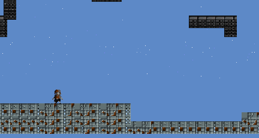

# Celeste Mechanics

        
        

Un pequeño prototipo de las mecánicas de celeste.

### Prerequisites

-  Unity ver. 2019.4.34 o mayor

## Assets

* [DOTween](http://dotween.demigiant.com/) - DOTween es un motor de animación orientado a objetos rápido, eficiente y totalmente seguro para tipos para Unity, optimizado para usuarios de C#, gratuito y de código abierto, con toneladas de funciones avanzadas.
* [Red hood pixel character](https://legnops.itch.io/red-hood-character) - Un personaje con animaciones en 2D descargado de itch.io.
* [Mini Fantasy Dungeon](https://krishna-palacio.itch.io/minifantasy-dungeon) - Un tileset simple de mazmorra creado por Krishna Palacio.
## Authors

* **Dairon Luis Naranjo** - [Github](https://github.com/daironln/)
